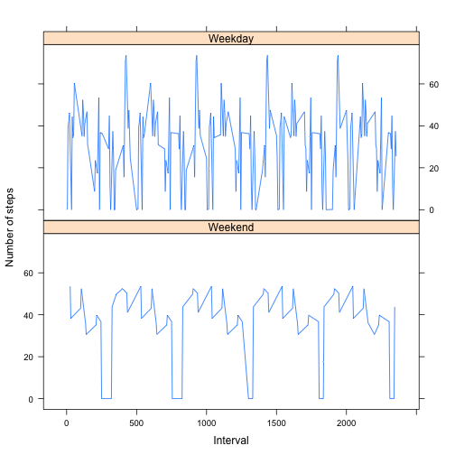

# Reproducible Research: Peer Assessment 1


## Loading and preprocessing the data

```r

inputData <- read.csv(file = "activity.csv")
```


## What is mean total number of steps taken per day?

**1.Histogram of the total number of steps taken each day**

```r
stepsEachDay <- aggregate(inputData$steps, by = list(inputData$date), FUN = sum)
hist(stepsEachDay$x, breaks = 10, main = "Histogram of total steps per day", 
    xlab = "steps/day")
```

 


**2.The mean and median of total number of steps taken per day**

```r
mean(stepsEachDay$x, na.rm = TRUE)
```

```
## [1] 10766
```

```r
median(stepsEachDay$x, na.rm = TRUE)
```

```
## [1] 10765
```

```r
summary(stepsEachDay)
```

```
##        Group.1         x        
##  2012-10-01: 1   Min.   :   41  
##  2012-10-02: 1   1st Qu.: 8841  
##  2012-10-03: 1   Median :10765  
##  2012-10-04: 1   Mean   :10766  
##  2012-10-05: 1   3rd Qu.:13294  
##  2012-10-06: 1   Max.   :21194  
##  (Other)   :55   NA's   :8
```


From the above summary, 
- **Mean = 10766** 
- **Median = 10765** 

## What is the average daily activity pattern?

**1.Time series plot of the 5-minute interval (x-axis) and the average number of steps taken, averaged across all days (y-axis)**


```r
avgDailySteps <- tapply(inputData$steps, inputData$interval, mean, na.rm = TRUE)
plot(unique(inputData$interval), avgDailySteps, type = "l", xlab = "Interval", 
    ylab = "average steps")
```

 


**2.Which 5-minute interval, on average across all the days in the dataset, contains the maximum number of steps?**

```r
which.max(avgDailySteps)
```

```
## 835 
## 104
```

```r
max(avgDailySteps)
```

```
## [1] 206.2
```

The maximum number of average steps of **206.2** is at interval **835** with index **104**.

## Imputing missing values
**1.Calculating the total number of missing values**


```r
summary(inputData)
```

```
##      steps               date          interval   
##  Min.   :  0.0   2012-10-01:  288   Min.   :   0  
##  1st Qu.:  0.0   2012-10-02:  288   1st Qu.: 589  
##  Median :  0.0   2012-10-03:  288   Median :1178  
##  Mean   : 37.4   2012-10-04:  288   Mean   :1178  
##  3rd Qu.: 12.0   2012-10-05:  288   3rd Qu.:1766  
##  Max.   :806.0   2012-10-06:  288   Max.   :2355  
##  NA's   :2304    (Other)   :15840
```

There are total of **2304** missing values in the steps column of the dataset.

**2.Strategy for filling the missing values**

Considered using the sapply() with a custome function() which will calculate the median of missing values.


```r
newInputData <- data.frame(inputData)
library(plyr)
impute.med <- function(x) replace(x, is.na(x), median(x, na.rm = TRUE))
inputDataWithOutNA <- sapply(inputData, function(x) {
    if (is.numeric(x)) {
        impute.med(x)
    } else {
        x
    }
})
```

Filled the NA values with median values.

**3.New dataset that is equal to the original dataset with the missing data filled in.** 

**Original Dataset**

```r
summary(inputData)
```

```
##      steps               date          interval   
##  Min.   :  0.0   2012-10-01:  288   Min.   :   0  
##  1st Qu.:  0.0   2012-10-02:  288   1st Qu.: 589  
##  Median :  0.0   2012-10-03:  288   Median :1178  
##  Mean   : 37.4   2012-10-04:  288   Mean   :1178  
##  3rd Qu.: 12.0   2012-10-05:  288   3rd Qu.:1766  
##  Max.   :806.0   2012-10-06:  288   Max.   :2355  
##  NA's   :2304    (Other)   :15840
```

```r
head(inputData)
```

```
##   steps       date interval
## 1    NA 2012-10-01        0
## 2    NA 2012-10-01        5
## 3    NA 2012-10-01       10
## 4    NA 2012-10-01       15
## 5    NA 2012-10-01       20
## 6    NA 2012-10-01       25
```

**Filled in Dataset**

```r
newInputData <- data.frame(inputDataWithOutNA[, 1], inputData$date, inputData$interval)
colnames(newInputData) <- c("steps", "date", "interval")
summary(newInputData)
```

```
##      steps               date          interval   
##  Min.   :  0.0   2012-10-01:  288   Min.   :   0  
##  1st Qu.:  0.0   2012-10-02:  288   1st Qu.: 589  
##  Median :  0.0   2012-10-03:  288   Median :1178  
##  Mean   : 32.5   2012-10-04:  288   Mean   :1178  
##  3rd Qu.:  0.0   2012-10-05:  288   3rd Qu.:1766  
##  Max.   :806.0   2012-10-06:  288   Max.   :2355  
##                  (Other)   :15840
```

```r
head(newInputData)
```

```
##   steps       date interval
## 1     0 2012-10-01        0
## 2     0 2012-10-01        5
## 3     0 2012-10-01       10
## 4     0 2012-10-01       15
## 5     0 2012-10-01       20
## 6     0 2012-10-01       25
```


**4.Histogram of the total number of steps taken each day**

```r
newStepsEachDay <- aggregate(newInputData$steps, by = list(newInputData$date), 
    FUN = sum)
summary(newStepsEachDay$x)
```

```
##    Min. 1st Qu.  Median    Mean 3rd Qu.    Max. 
##       0    6780   10400    9350   12800   21200
```

```r
hist(newStepsEachDay$x, breaks = 10, main = "Histogram of total steps per day", 
    xlab = "steps/day")
```

 


**The mean and median of total number of steps taken per day**

```r
mean(newStepsEachDay$x, na.rm = TRUE)
```

```
## [1] 9354
```

```r
median(newStepsEachDay$x, na.rm = TRUE)
```

```
## [1] 10395
```

```r
summary(newStepsEachDay)
```

```
##        Group.1         x        
##  2012-10-01: 1   Min.   :    0  
##  2012-10-02: 1   1st Qu.: 6778  
##  2012-10-03: 1   Median :10395  
##  2012-10-04: 1   Mean   : 9354  
##  2012-10-05: 1   3rd Qu.:12811  
##  2012-10-06: 1   Max.   :21194  
##  (Other)   :55
```


From the above summary, 
- **Mean = 9354** 
- **Median = 10395** 

We can observe a chnage in Mean & Median values when we have considered the missing values.

## Are there differences in activity patterns between weekdays and weekends?
**1.Creating a new factor variable in the dataset with two levels indicating whether a given date is a weekday or weekend day.** 


```r
newInputData$date <- as.POSIXlt(newInputData$date)
newInputData$dayLogical <- factor(weekdays(newInputData$date) == "Sunday" | 
    weekdays(newInputData$date) == "Saturday", levels = c(TRUE, FALSE), labels = c("Weekend", 
    "Weekday"))
str(newInputData)
```

```
## 'data.frame':	17568 obs. of  4 variables:
##  $ steps     : num  0 0 0 0 0 0 0 0 0 0 ...
##  $ date      : POSIXlt, format: "2012-10-01" "2012-10-01" ...
##  $ interval  : int  0 5 10 15 20 25 30 35 40 45 ...
##  $ dayLogical: Factor w/ 2 levels "Weekend","Weekday": 2 2 2 2 2 2 2 2 2 2 ...
```

**2.Time series plot of the 5-minute interval (x-axis) and the average number of steps taken, averaged across all weekday days or weekend days (y-axis).**

To work towards the solution for this problem, First an average of steps on Date is taken and it is factorized to two levels and are labeled as Weekday and Weekend day. Finally a Lattice plot is drawn.


```r
library(lattice)
newAvgStepsPerDay <- aggregate(newInputData$steps, by = list(inputData$date), 
    FUN = mean)
newAvgStepsPerDay$Group.1 <- as.POSIXlt(newAvgStepsPerDay$Group.1)
newAvgStepsPerDay$dayLogical <- factor(weekdays(newAvgStepsPerDay$Group.1) == 
    "Sunday" | weekdays(newAvgStepsPerDay$Group.1) == "Saturday", levels = c(TRUE, 
    FALSE), labels = c("Weekend", "Weekday"))
xyplot(newAvgStepsPerDay$x ~ unique(newInputData$interval) | newAvgStepsPerDay$dayLogical, 
    type = "l", layout = (c(1, 2)), xlab = "Interval", ylab = "Number of steps")
```

 

 
